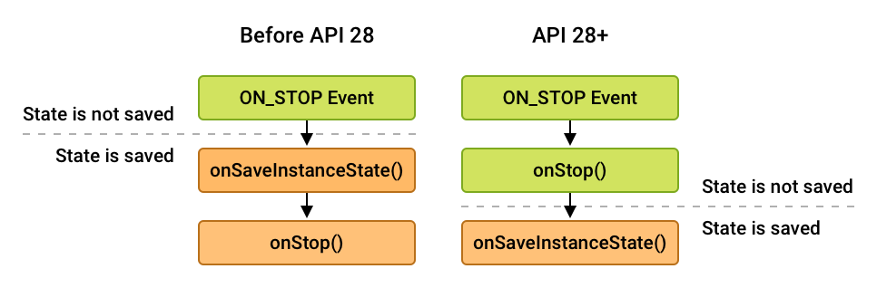

# Lifecycle (생명주기)

## Activity Lifecycle

### onCreate()
- 액티비티가 생성될 때 실행됩니다.

### onStart()
- 여기부터 사용자에게 Activity 가 표시됩니다.

### onResume()
- 사용자와 본격적으로 앱과 상호작용할 수 있습니다.
- 특정 상황이 발생하지 않으면 계속 onResume 상태에 머뭅니다.

### onPause()
- 해당 Activity 가 foreground process 를 떠나있을 때 호출됩니다.  
  (상황에 따라 Activity 가 여전히 사용자에게 보이는 경우가 있음)
- UI 관련 리소스와 작업을 완전히 해제할 경우는 onPause 를 사용하지 않는 것이 좋습니다.
- 일부 Activity 가 보이는 상황에서 다시 Activity 가 포커스를 찾았을 때,

### onStop()
- 기존 Activity 가 아예 화면에서 벗어나면 호출됩니다.
- Activity 객체가 메모리 안에 머물게 되고, 시스템은 각 View 객체의 현재 상태를 기록합니다.
  (그래서 홈버튼으로 화면을 벗어났다가 다시 돌아와도 UI 데이터들이 그대로 남아 있음)
- 필요하지 않은 리소스를 해제하거나 CPU 를 비교적 많이 소모하는 종료 작업을 실행합니다.

### onDestroy()
- 두가지 경우로 Activity 가 소멸되기 직전에 호출됩니다.
  - Activity 가 종료되는 경우
  - 화면 회전과 같은 이유로 시스템이 일시적으로 Activity 를 소멸시키는 경우
- 리소스 해제가 있으면 이곳에서 처리합니다.

### onRestart()
- 유저의 액션에 따라 해당 Activity 가 홤녀에서 벗어났다가 다시 불러왔을 때 호출됩니다.
- `onStop -> onRestart -> onStart` 순서대로 호출됩니다.

---

### 특정 상황에서의 lifecycle
#### [1] `A` Activity 실행
1. `A` onCreate
2. `A` onStart
3. `A` onResume

#### [2] `A` -> `B` Activity 이동
1. [1]에서 시작
2. `A` onPause
3. `B` onCreate
4. `B` onStart
5. `B` onResume
6. `A` onPause
7. `A` onSaveInstanceState

#### [3] `B`->`A` Activity 뒤로가기
1. [2]에서 시작
2. `B` onPause
3. `A` onRestart
4. `A` onStart
5. `A` onResume
6. `B` onStop
7. `B` onDestroy

---

## Fragment Lifecycle
Framgnet 의 Lifecycle 은 다음과 같이 일반 lifecycle 형태와 ViewLifecycle 상태로 나뉩니다.

### onAttach()
- Fragment 가 Activity 에 attach 된 상태입니다.

### onCreate()
- Fragment 자체가 생성된 상태입니다.
- 뷰는 아직 생성되지 않은 상태이므로, 뷰와 관련된 작업을 하는 것은 적절하지 않습니다.

### onCreateView()
- Framgnet 의 뷰가 초기화 됩니다.
- 정상적으로 초기화가 되었다면 뷰 객체를 반환합니다.

### onViewCreated()
- onCreateView 에서 뷰 객체가 반환된 직후 호출됩니다.
- 뷰가 완전히 생성되었음을 보장하며, 뷰에 대한 참조나 작업을 진행하기 적합합니다.

### onViewStateRestored()
- 저장된 모든 state 값이 fragment 뷰의 계층 구조에 복원되었을 때 호출됩니다.
- 각 뷰의 상태값을 체크해서 표시합니다.

### onStart()
- 사용자에게 framgnet 가 보이게 되는 상태입니다.
- childFragmentManager 를 통해 FragmentTransaction 을 안전하게 수행할 수 있습니다.

### onResume()
- 사용자가 fragment 에 상호작용할 수 있는 상태입니다.
- Fragment 가 보이는 상태에서 모든 animator 와 transition 효과가 종료된 후 호출됩니다.

### onPause()
- 사용자가 fragment 를 떠났지만 기존 fragment 가 조금이라도 보일 때 호출됩니다.
- 이때 fragment 의 ViewLifecycle 은 `PAUSED` 가 아닌 `STARTED` 상태가 됩니다.

### onStop()
- Framgnet 가 더이상 보이지 않을 때 호출됩니다.
- API 28 이후 onSaveInstanceState 와 onStop 의 호출 순서가 달렸습니다.
- 따라서, onStop 이 FragmentTransaction 을 안전하게 수행하는 마지막 지점이 되었습니다.

### onDestoryView()
- 모든 exit animation 과 transaction 이 완료되고 뷰가 소멸될 시에 호출됩니다.
- 이때 fragment 자체는 아직 메모리에 남아있으므로, 뷰에 대한 모든 참조를 제거해야 메모리 누수를 방지할 수 있습니다.
- ViewBinding 을 사용하는 경우 binding 변수를 null 로 만들어주는 것이 좋습니다.

### onDestory()
- Fragment 또는 fragment manager 가 소멸되었을 경우 호출됩니다.

### onDetach()
- Fragment 가 Activity 에 attach 된 상태입니다.
