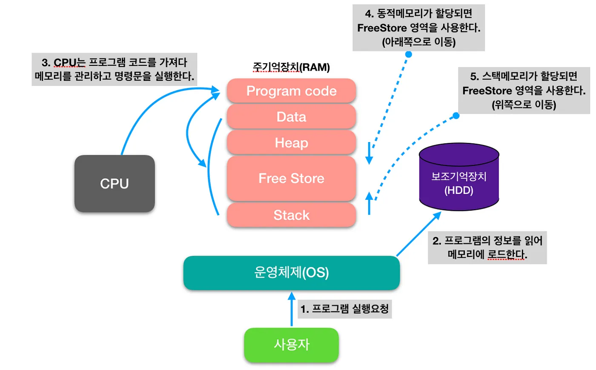

# 📚 메모리 구조

## 코드 영역
- 실행할 프로그램의 코드

## 데이터 영역
- 전역 변수
- 정적 변수 (static 키워드 변수)
- 프로그램 실행 시 생성 / 종료 시 반환
- 즉, 프로그램 시작부터 종료때까지 메모리에 남아 있음  
  (전역 변수와 정적 변수가 사용하기 편하다고 막 선언하면 OOM 발생)

## 힙 영역
- 사용자의 동적 할당
- 런타임에 크기가 결정됨
- 참조형의 데이터 타입을 갖는 객체, 배열 등
- 데이터가 더 이상 사용되지 않으면 GC에서 메모리 해제

## 스택 영역
- 지역 변수, 매개 변수
- 컴파일 타임에 크기가 결정됨
- 메소드 내에 정의하는 기본 자료형
- 프로그램이 자동으로 사용하는 임시 메모리
- LIFO 구조를 갖고 변수에 데이터가 새로 할당되면 이전 데이터는 지워짐
- 메소드 호출 시 생성 / 메소드 종료 시 메모리 해제
- 힙과 스택은 같은 공간을 공유 (힙: 위 / 스택: 아래)

## 기타
- 스택 오버플로우 : 스택이 힙 영역 침범
- 힙 오버플로우 : 힙이 스택 영역 침범
